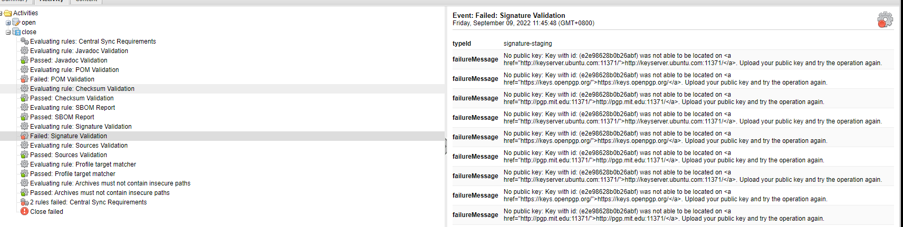

## 发布Maven Central
[流程参考](https://blog.csdn.net/Lover29/article/details/126190868)

### gpg配置
[使用方法](https://blog.csdn.net/willingtolove/article/details/122362705)
#### 1. 生成.gpg
新版的的gpg。生成主密钥后，生成的是**pubring.kbx**
```
C:\Users\admin>gpg --list-keys
C:\Users\admin\AppData\Roaming\gnupg\pubring.kbx
------------------------------------------------
pub   rsa3072 2022-09-09 [SC]
      D27AD412FE75C77580ED73A8E2E98628B0B26ABF
uid           [ultimate] dongjunjie (main) <361170803@qq.com>
sub   rsa3072 2022-09-09 [E]

```
但是**apply plugin: 'signing'** 中需要的是.gpg。不然会报错
```
gpg --export-secret-keys >secring.gpg
```
#### 2. 上传公钥
在最后上传到maven库的时候，需要验证签名。所以也必须提前上传

```
gpg --keyserver hkp://keyserver.ubuntu.com:11371 --send-keys  E2E98628B0B26ABF
```

#### 3. signing配置问题
在gradle.properties中配置的keyId必须是**后8位**
[Gradle 对包进行签名的时候提示错误 00B5050F](https://blog.csdn.net/huyuchengus/article/details/111714493)
```
signing.keyId=B0B26ABF
signing.password=djj123456
signing.secretKeyRingFile=secring.gpg

```

### 2.POM必须详尽


 